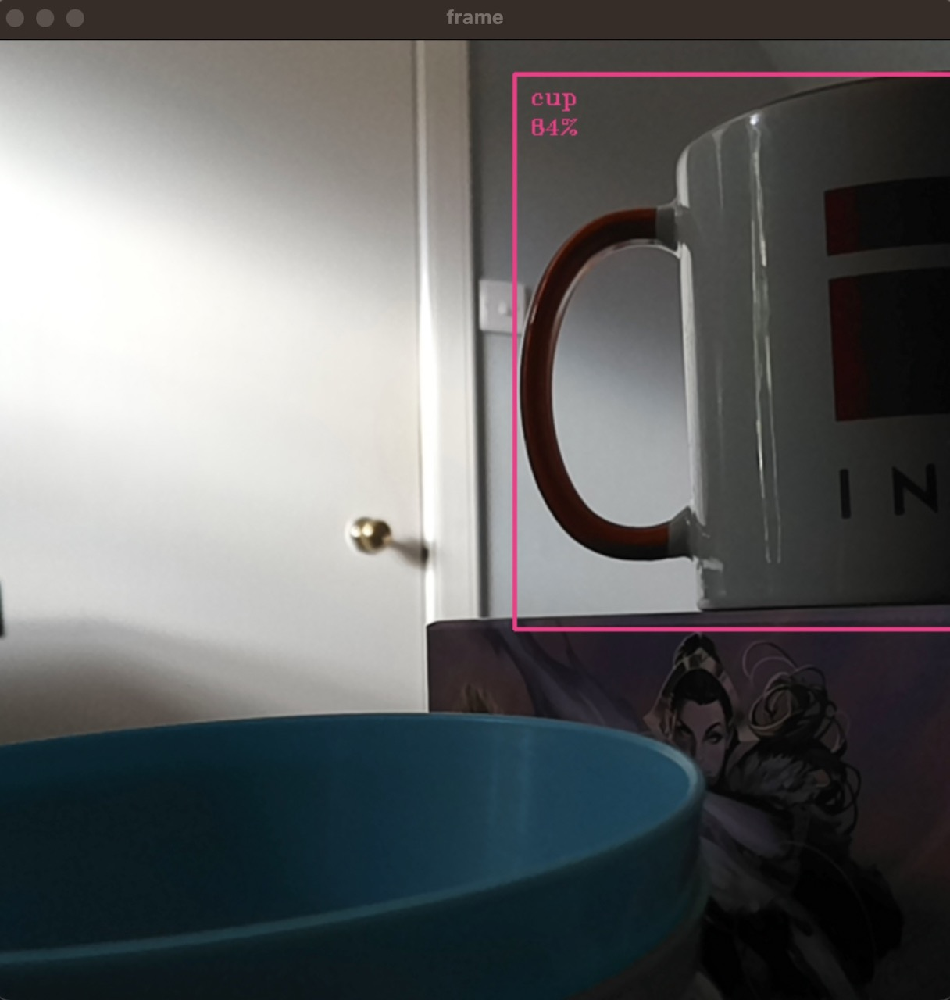
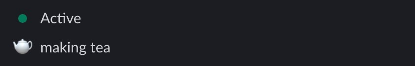

# Roboflow Tea Intake Tracker

A computer vision model deployed on a Luxonis OAK camera to monitor my tea intake.

When a tea break starts or ends, your Slack status can optionally be updated to reflect that you are making a cup of tea.

## Screenshots





## What You'll Need

To run this project, you will need:

1. [A free Roboflow account](https://app.roboflow.com).
2. A Luxonis OAK camera (any model).

To use this model to update your Slack status, you will need access to a Slack workspace where you have admin access. This is optional.

## Getting Started

First, install the required dependencies for this project:

```
git clone https://github.com/capjamesg/roboflow-tea-detector
cd roboflow-tea-detector
pip3 install -r requirements.txt
```

Next, plug your OAK camera into your computer.

Go to the [Roboflow Dashboard](https://app.roboflow.com) and follow our "[Obtaining your API key](https://docs.roboflow.com/rest-api#obtaining-your-api-key)" instructions to find out how to get your API key. Then, run the following command on your machine:

```
 export ROBOFLOW_KEY "YOUR_KEY_HERE"
```

Substitute `YOUR_KEY_HERE` with the key associated with your account. Make sure to add a space before `export` so the command is not saved in your shell history.

Remember, this key is private. Don't publish the key anywhere.

If you want to send your tea break status to Slack, you will need to:

1. [Create a Slack bot](https://api.slack.com)
2. Click "OAuth & Permissions"
3. Add the `users.profile:read` and `users.profile.write` scopes to the `User Token Scopes` section.
4. Install the project to your workspace.
5. Run ` export SLACK_KEY "YOUR_SLACK_KEY"` and replace `YOUR_SLACK_KEY` with the `User OAuth Token` returned by Slack.

This will let you send your status to Slack.

Now we're ready to start using the model. To start using the model, run the `app.py` script:

```
python3 app.py
```

This script will open up a window that shows the camera feed from your OAK camera.

## Usage

1. Place a mug in front of the camera and see if it is detected.
2. If your mug is detected and you move it away for 4 seconds, a tea break will be recorded in the `tea_breaks.json` file. **This value should be changed in production by amending the `DELAY` value in `app.py`. 4 seconds is a good number for testing.**
3. When you bring a mug back into view, the `tea_breaks.json` file will be updated to show the duration of your coffee break.

If your mug is not detected, try moving the mug to a different angle. *Note: this model was only trained on mugs with handles. This model has not been tested at detecting mugs without handles*.

### Web chart

This script comes with a `template.py` file which plots your tea intake on a chart.

You can run this script using the following command:

```
python3 template.py
```

This script will generate a file called `out.html` with a record of all of the tea you have consumed in the day.

## License

The source code for this project is licensed under an [MIT license](LICENSE).

## Contributors

- capjamesg

## Acknowledgments

This model was built using Roboflow.